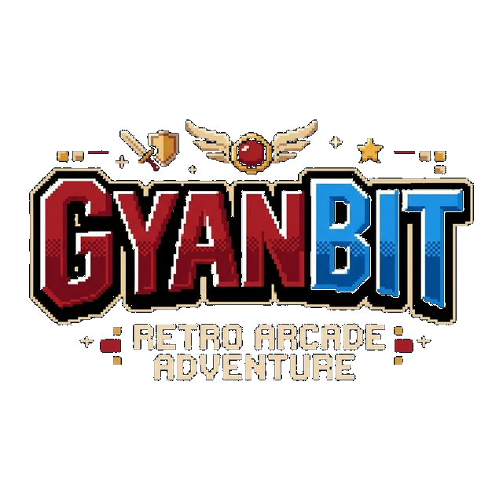

# 🎮 GyanBit: Code. Play. Build.

<p align="center">
  
</p>

<p align="center">
  <a href="https://vercel.com/"></a>
  <a href="https://nodejs.org/"></a>
  <a href="https://opensource.org/licenses/MIT"></a>
</p>

<p align="center">
  <strong>The First 8-bit Handheld Console Ecosystem for Indian Students.</strong>
</p>

---

## 🚀 What is GyanBit?

GyanBit is an open-source, DIY handheld game console designed for students aged 12–17. It empowers kids to move from **consumers** of technology to **creators** by combining a high-performance browser IDE (GyanBit Studio) with custom RP2040 hardware.

Write your code in **JavaScript** in the browser, test it in our pixel-perfect simulator, and flash it to real hardware with **one click** via WebSerial.

---

## 🤖 Meet BYTE Bot: Your AI Coding Buddy

Integrated directly into GyanBit Studio, **BYTE Bot** is a persistent, AI-powered assistant designed specifically for retro game development.

- **Moveable & Floating**: Draggable window that stays out of your code's way.
- **Smart Knowledge**: Trained on the full `bit.*` API, hardware pin maps, and game logic.
- **Multi-Provider**: Choose between **Groq** (Free & Ultra-Fast) or **Google Gemini**.
- **Privacy First**: All API keys are stored locally in your browser's `localStorage`.

---

## ✨ Features

| Category | Highlights |
|:---|:---|
| 🖥️ **Studio IDE** | React-powered editor, real-time OLED simulator, and dark-theme pixel interface. |
| 🛠️ **Project Flow** | Start fresh with **New Project**, or pick from 7 built-in game templates. |
| ⚡ **One-Click Flash** | Seamless JS → MicroPython translation and USB-C hardware flashing. |
| 🎮 **Built-in Games** | Snake, Pong, Breakout, Dodger, Maze, Flappy Bird, and Space Invaders. |
| 📖 **Tutorials** | Structured 4-part guide to building games from scratch. |
| 🧩 **Hardware** | RP2040 MCU, 1.3" OLED, D-Pad, and Bambo-fiber sustainable shell. |

---

## 📁 Technical Architecture

GyanBit uses a modern, high-performance web stack to deliver a "zero-setup" experience:

```
gyanbit/
├── studio.html          # IDE Entry (React App)
├── chatbot.js           # Self-contained AI Assistant logic
├── src/
│   ├── runtime/         # JavaScript Engine & bit.* API implementation
│   │   ├── MicroPythonGen.js  # JS to MicroPython transpiler 🪄
│   │   └── PixelFont.js       # Fast 5x7 bitmap renderer
│   ├── App.jsx          # IDE UI State Management
│   └── components/      # UI components (Editor, OLED, GamePad, etc.)
└── api/                 # Vercel serverless functions for AI proxying
```

---

## 🚀 Getting Started

### 1. Run Locally
```bash
# Clone the repo
git clone https://github.com/prathameshfuke/gyanbit.git
cd gyanbit

# Install and build
npm install
npm run dev
```
Navigate to `http://localhost:5173` to explore the ecosystem.

### 2. Deployment
GyanBit is optimized for **Vercel**. Simply import the repo, and Vite will be auto-detected for building.
- **Build Command**: `npm run build`
- **Output Dir**: `dist`

---

## 📖 `bit.*` API Reference

The GyanBit runtime provides a high-level API for rapid game development:

| Command | Usage |
|:---|:---|
| `bit.loop(fn)` | The core game loop (runs at ~30 FPS). |
| `bit.clear()` | Wipes the 128x64 display buffer. |
| `bit.text(x, y, str)` | Renders retro-styled text. |
| `bit.fill(x, y, w, h)` | Draws a filled rectangle. |
| `bit.isHeld('up')` | Checks if a button is currently pressed. |
| `bit.beep(hz, ms)` | Triggers a hardware-level square wave beep. |

---

## 🇮🇳 Made in India

Developed with ❤️ by the **Team TC26-GF-005 · MMCOE Pune**.
GyanBit was built to solve the lack of accessible, hands-on CS hardware for Indian rural students.

**License**: [MIT](https://opensource.org/licenses/MIT) © 2026 GyanBit
